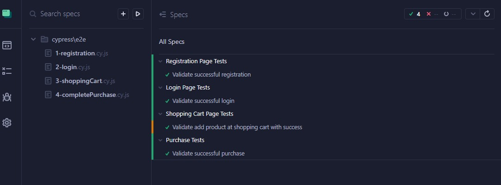

# Automation tests for WEBJUMP

## Features
### Test suite
* ✔️ Cypress, usado para criar e rodar a automação de testes E2E.
* ✔️ Faker, para gerar massa de testes aleatória para os testes.
* ✔️ Test retry, para repetir testes que falharem e evitar testes "flaky".

### Code quality
* ✔️ ESLint, para evitar erros no padrão do código e garantir uma boa qualidade do mesmo.

### CI/CD
* ✔️ [GitHub Actions](https://github.com/thaynaracdutra/webjump-automation-tests/actions), para acionar uma pipeline a cada push, essa pipeline executa os testes automatizados com Cypress e também o ESlint para garantir testes funcionando e um código de qualidade.
* ✔️ Mochawesome, para gerar relatório dos testes executados.

## 💻 Pré-requisitos para rodar o projeto na sua maquina

* Ter instalado uma IDE de sua preferencia, nesse projeto utilizamos o VS Code que pode ser encontrado [aqui](https://code.visualstudio.com/).
* Ter instalado a versão npm 8.0+ e node 16.0+

## ⚙️ Rodando o projeto na sua maquina

Inicialmente, você deve clonar o projeto para sua máquina, caso tenha dúvidas de como fazer você pode seguir o passo a passo para clonagem via IDE VS Code [aqui](https://learn.microsoft.com/pt-br/azure/developer/javascript/how-to/with-visual-studio-code/clone-github-repository?tabs=create-repo-command-palette%2Cinitialize-repo-activity-bar%2Ccreate-branch-command-palette%2Ccommit-changes-command-palette%2Cpush-command-palette).

Link para clonagem do projeto:
```
git clone https://github.com/thaynaracdutra/webjump-automation-tests.git
```

Após clonar o repositório para sua máquina você deverá instalar as dependencias do projeto inserindo o comando abaixo no seu terminal:
```
npm install
```

Para executar os testes automatizados em modo headless, você pode inserir o comando abaixo no terminal:
```
npm run cy:run
```

Para executar os testes  automatizados em modo headed em um navegador, você pode inserir o comando abaixo no terminal, selecionar E2E testing e o navegador desejado:
```
npm run cy:open
```

Ao finalizar, todos os testes devem ter sido realizados sem falhas.

## 👩🏽‍💻 Evidencia dos testes executados

Evidencia dos testes executados.
<p align="center"></p>

## Comentários do autor

* Este projeto conta com a execução via pipeline GitHub Actions, que é executada a cada commit e pode ter suas execuções visualizadas [aqui](https://github.com/thaynaracdutra/webjump-automation-tests/actions).
